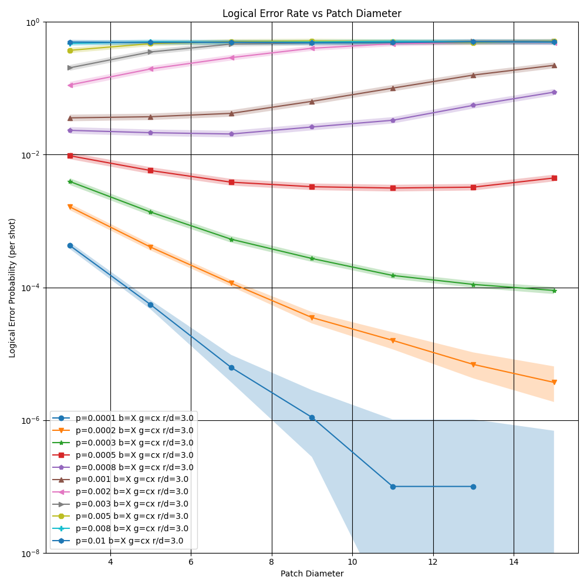
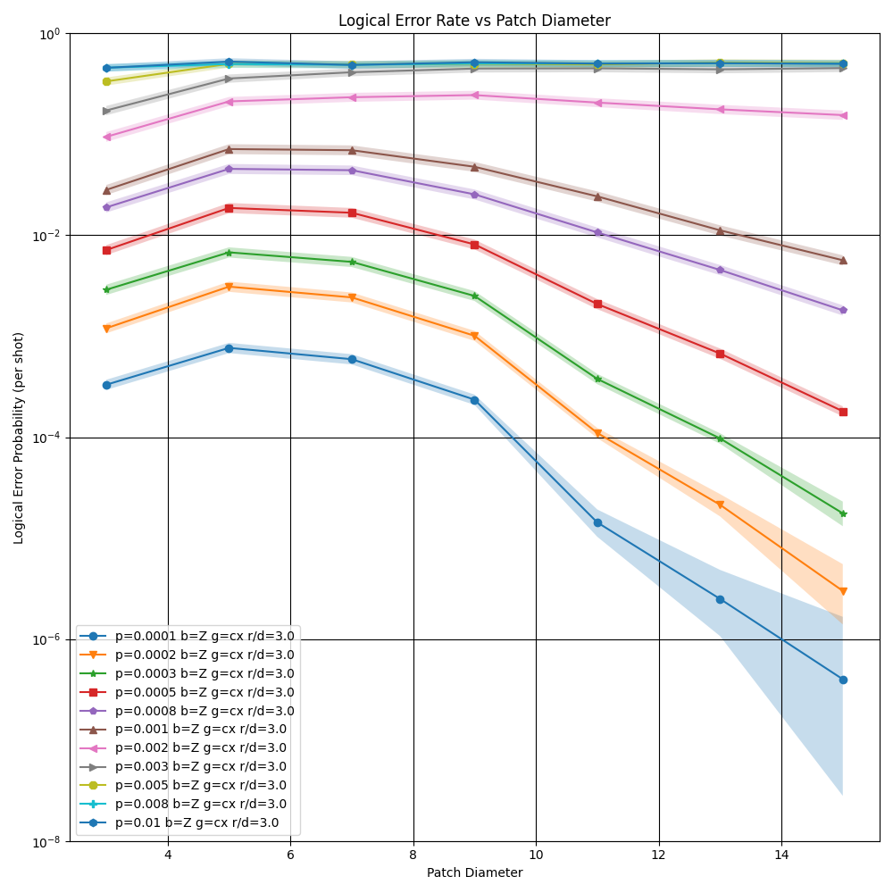
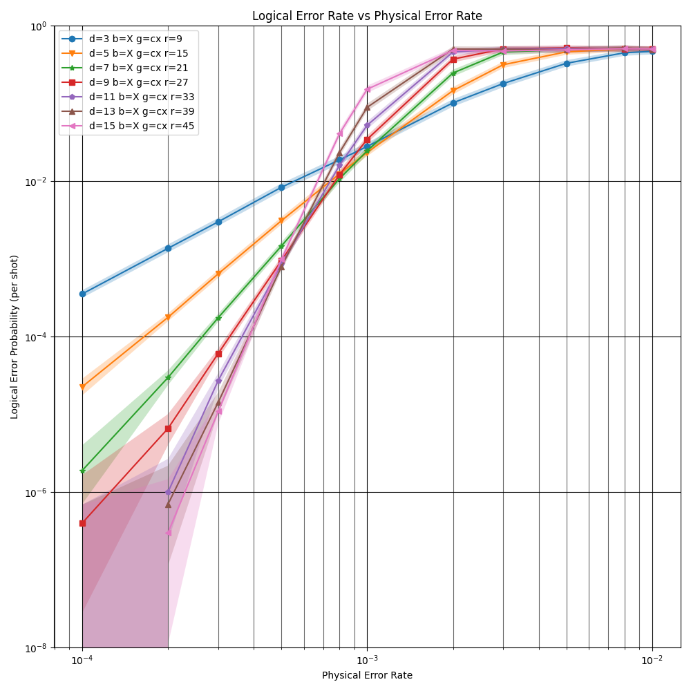
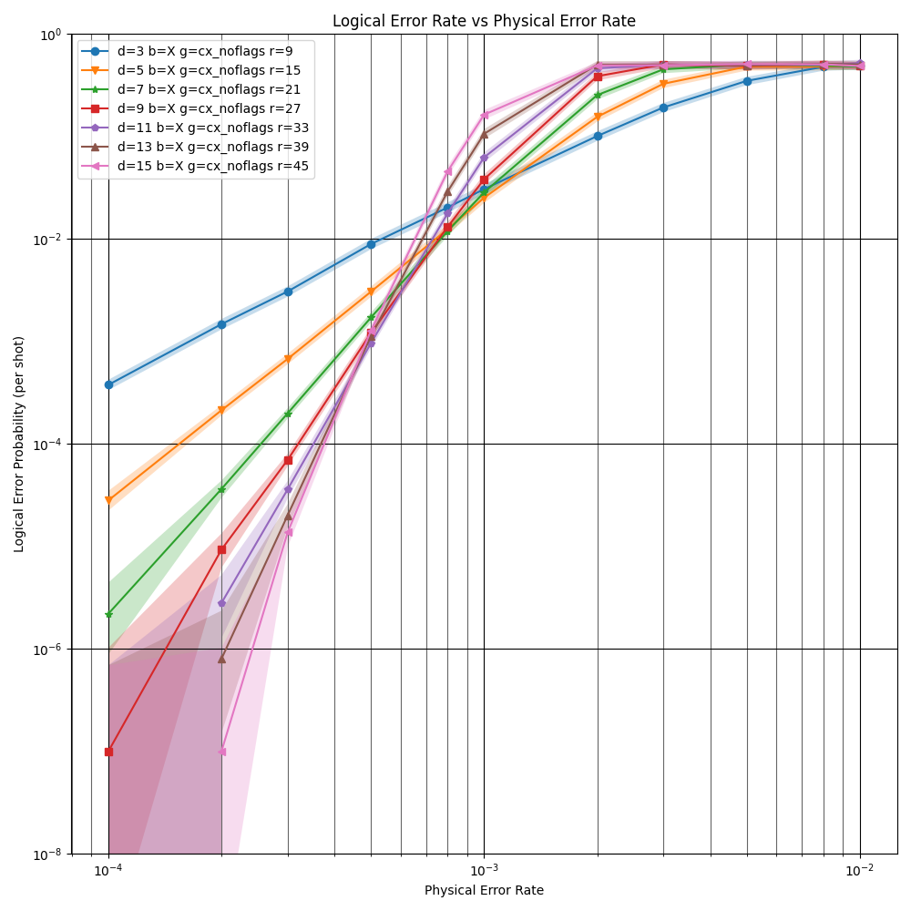
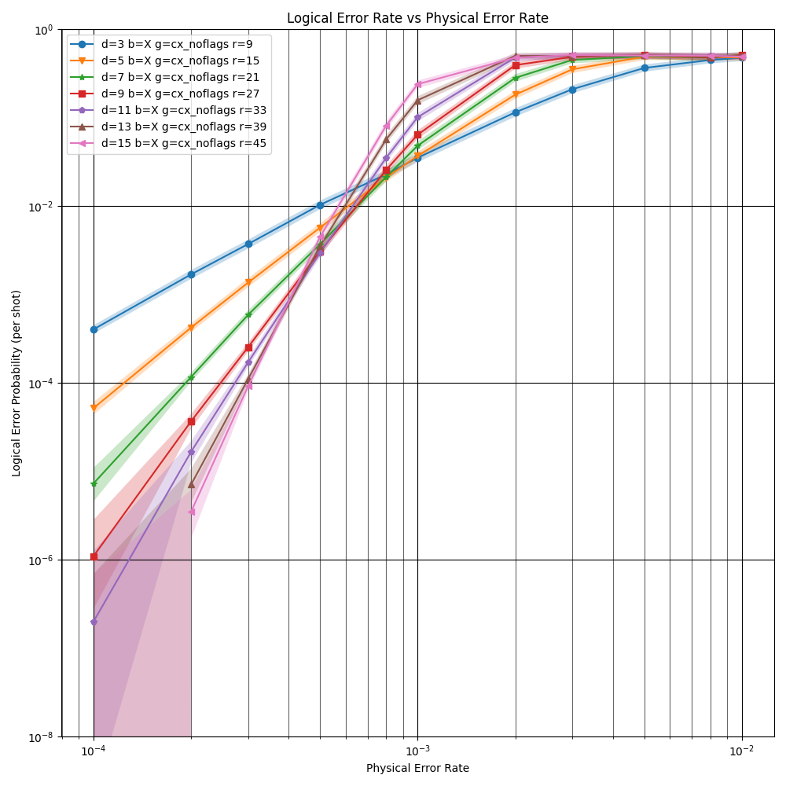
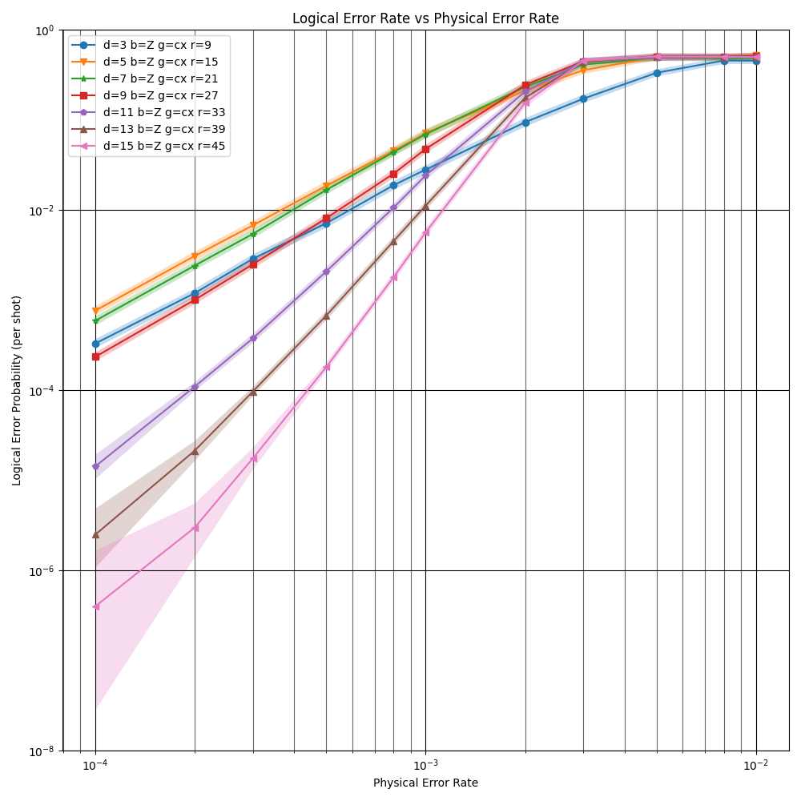
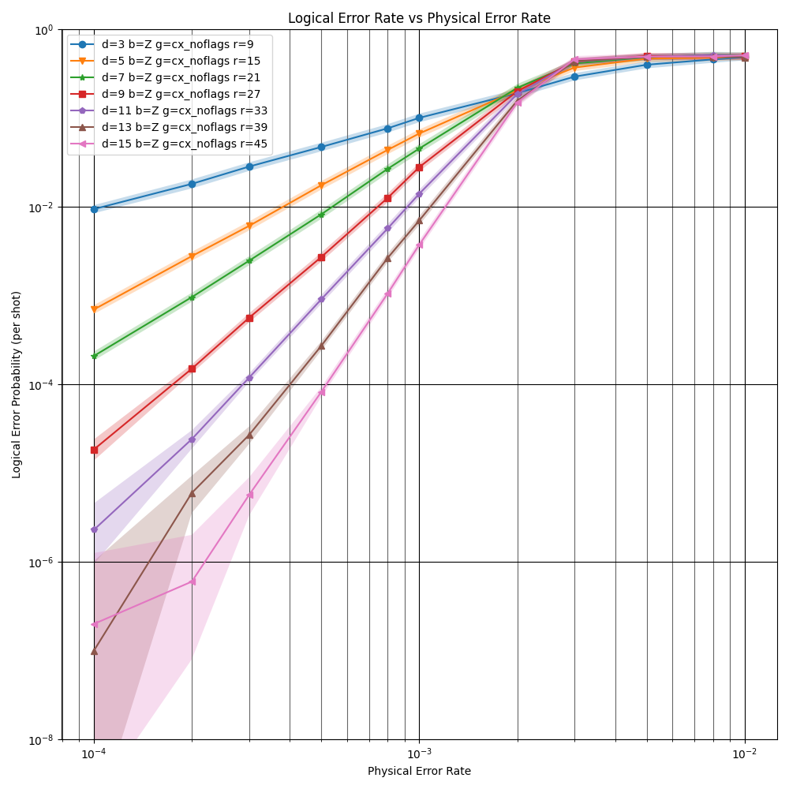

# Heavy Hex Demo

The code in this repository was written as a demonstration of using stim to analyze an error correcting code, for the IBM quantum summer school.

```bash
# regenerate circuits:
./step1_make_circuits.sh

# recollect data (using pymatching)
./step2_collect_data.sh

# regenerate plots
./step3_make_plots.sh
```

Plotting logical error rate vs distance:

| X BASIS (no threshold)                | Correlated Matching                                                          | Uncorrelated Matching                                                          |
|---------------------------------------|------------------------------------------------------------------------------|--------------------------------------------------------------------------------|
| Flag measurements marked as detectors |           |           |
| Flag measurements not included        |  |  |


| Z BASIS                | Correlated Matching                                                          | Uncorrelated Matching                                                          |
|---------------------------------------|------------------------------------------------------------------------------|--------------------------------------------------------------------------------|
| Flag measurements marked as detectors |           |           |
| Flag measurements not included        |  |  |

Plotting logical error rate vs physical error rate:

| X BASIS (no threshold)                | Correlated Matching                                                     | Uncorrelated Matching                                                          |
|---------------------------------------|-------------------------------------------------------------------------|--------------------------------------------------------------------------------|
| Flag measurements marked as detectors |           |           |
| Flag measurements not included        |  |  |


| Z BASIS                | Correlated Matching                                                          | Uncorrelated Matching                                                          |
|---------------------------------------|------------------------------------------------------------------------------|--------------------------------------------------------------------------------|
| Flag measurements marked as detectors |           |           |
| Flag measurements not included        |  |  |
