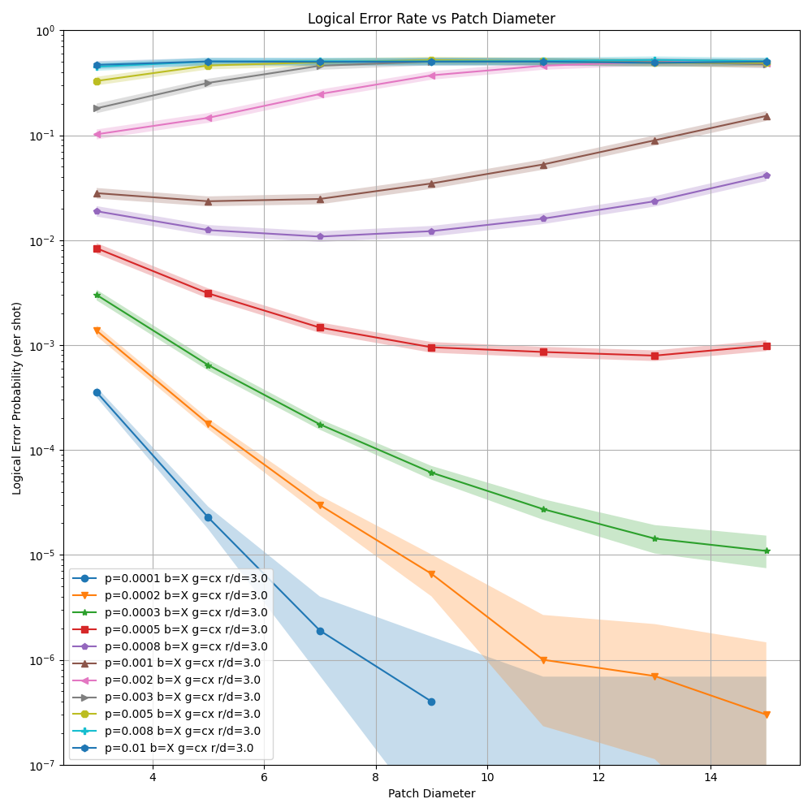
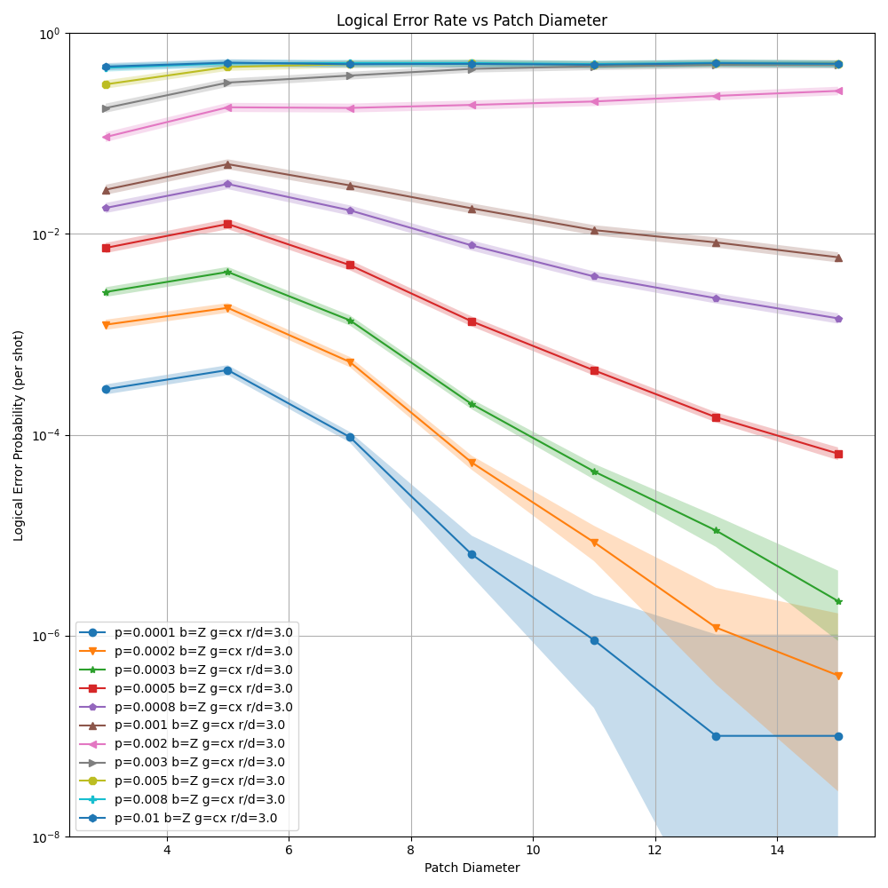
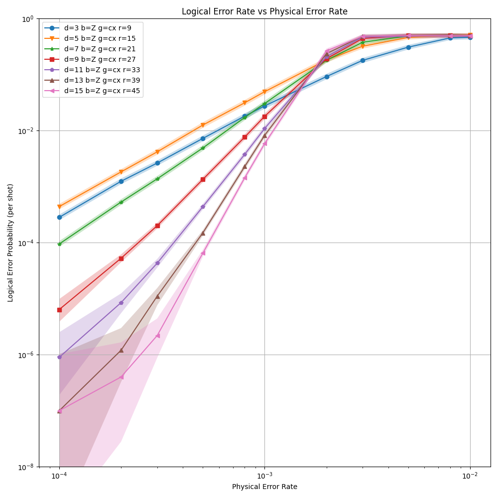

# Heavy Hex Demo

The code in this repository was written as a demonstration of using stim to analyze an error correcting code, for the IBM quantum summer school.

```bash
# regenerate circuits:
./step1_make_circuits.sh

# recollect data (using pymatching)
./step2_collect_data.sh

# regenerate plots
./step3_make_plots.sh
```

Logical error rate of X observable vs distance for various physical error rates.
The X observable is the one with no threshold, which is why the curves bend back upward.



Logical error rate of Z observable vs distance for various physical error rates.
I don't understand why 3-to-5 consistently makes this one worse.
Based on the pink line going almost straight, the threshold is roughly around 0.002.



Logical error rate of X observable vs physical error rate for various distances.
Note that this is error PER SHOT, not per round, which makes the curves look higher than you otherwise might expect.


Logical error rate of Z observable vs physical error rate for various distances.
Note that this is error PER SHOT, not per round, which makes the curves look higher than you otherwise might expect.


